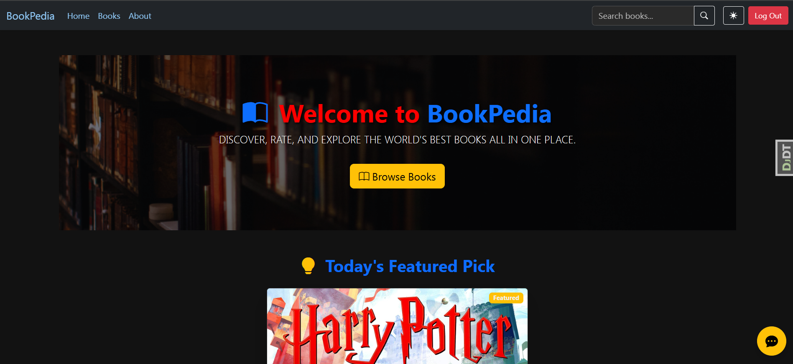
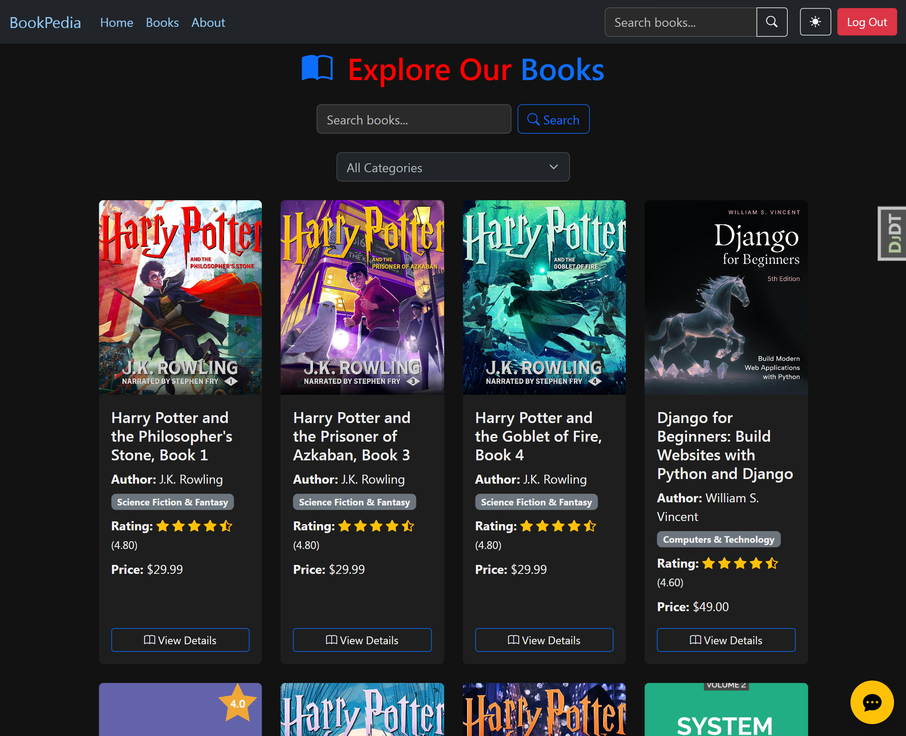
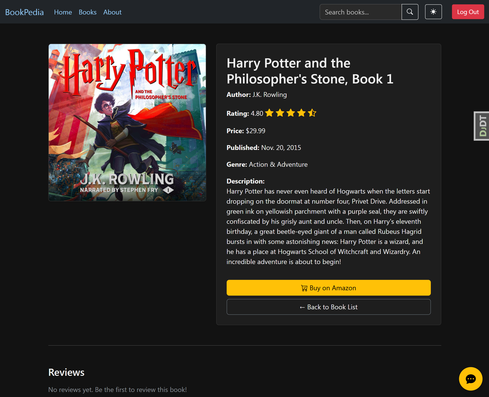
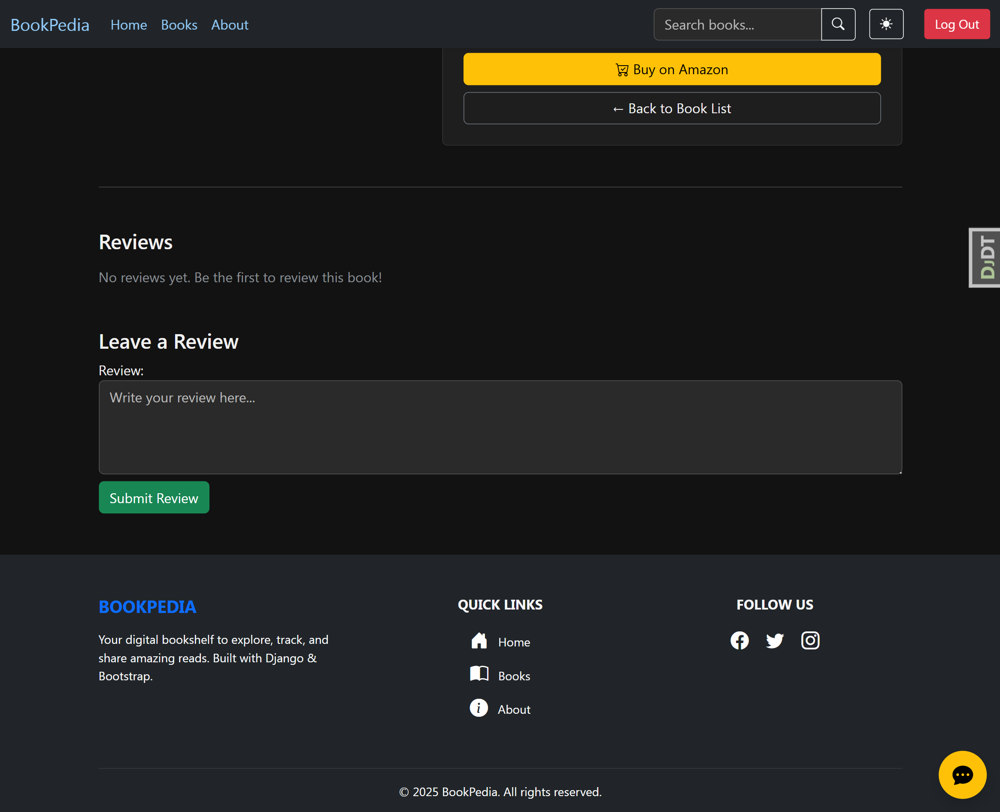
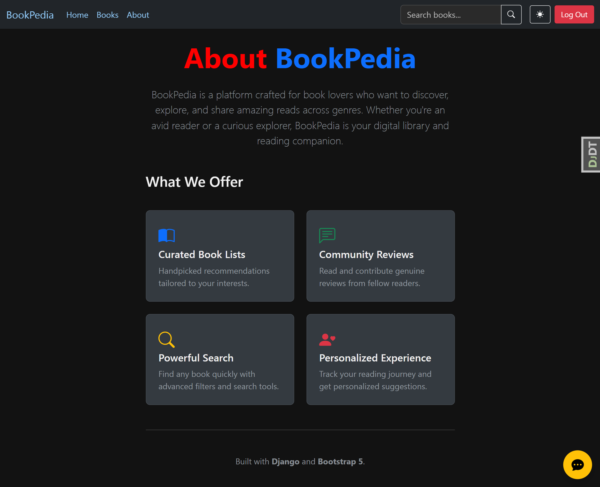
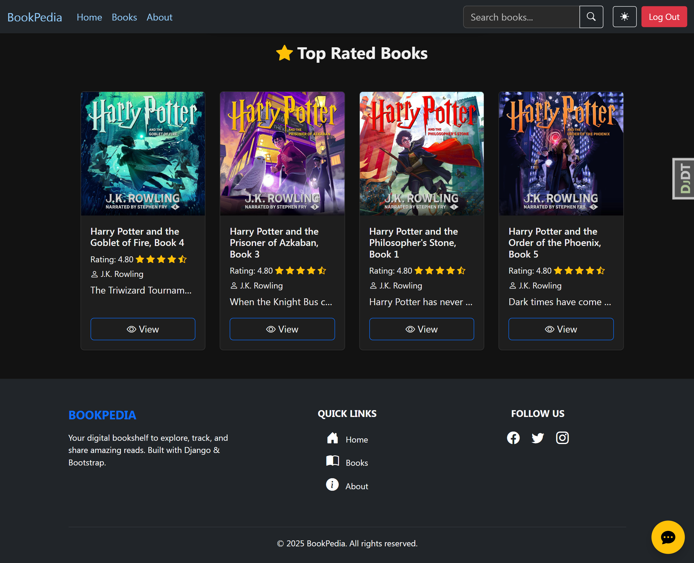
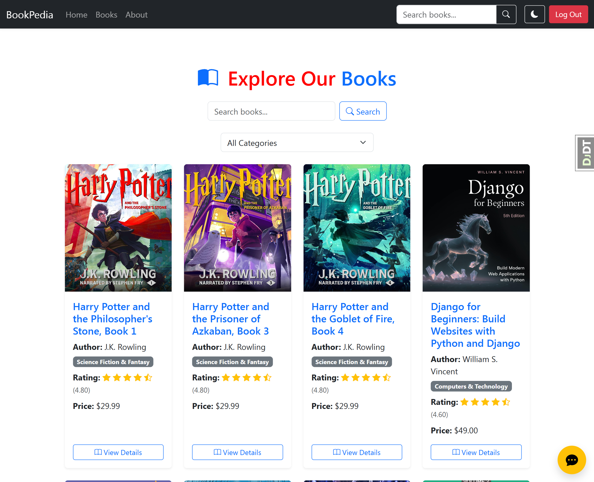
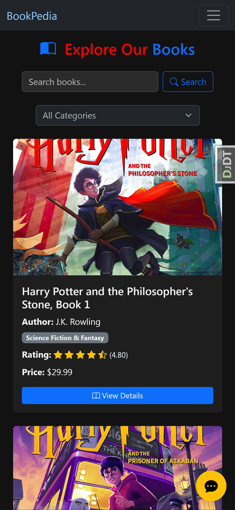

# 📚 BookPedia – Online Bookbrowsing web application

**BookPedia** is a professional-grade online book-browsing web application built with the Django framework. It allows users to browse, search, purchase, and review books with a secure and modern e-commerce experience. Designed for learning and showcasing full-stack Django development.

---

## 🚀 Features(Till now)

- 📚 Online book catalog with real book data
- 🔍 Filter by category and search by title or author
- 📖 Detailed book pages with user-submitted reviews
- 🛒 Buy button with Amazon product links (external purchase)
- 🤖 Integrated chatbot for enhanced user experience
- 🧑‍💻 Custom user authentication and permissions
- 🔐 Access-controlled views using Django's permission system (`special_status`)
- 🧾 Django Admin panel customization for managing books, categories, and reviews
- 🐳 Dockerized setup for both development and production environments
- 🔃 Page caching middleware support for production (disabled in development)
- 🧪 Unit-tested with Django’s built-in testing framework
---

## 🛠️ Tech Stack

- **Backend**: Django (Class-based Views), Python 3.11+
- **Frontend**: HTML, CSS, Bootstrap (Django templates)
- **Database**: PostgreSQL
- **Authentication**: `django-allauth`
- **Caching**: File-based caching middleware (for production)
- **DevOps**: Docker, Docker Compose, `.env` configuration
- **Version Control**: Git + GitHub

---

## 📁 Project Structure
```
bookpedia/ 
├── accounts/                   # Custom user model & authentication 
├── books/                      # Book, Category & Review models, views, template  
├── pages/                      # Static pages like Home, About 
├── templates/                  # Global and app-specific templates 
├── static/                     # Static files (CSS, JS, Images) 
├── .env                        # Environment variables
├── docker-compose.yml          # For development
├── docker-compose.prod.yml     # For production deployment 
├── requirements.txt 
├── manage.py  
└── requirements.txt                 
 ```


## ⚙️ Setup Instructions

### 1. Clone the Repository

```
git clone https://github.com/your-username/bookpedia.git
cd bookpedia
```
### 2. Create .env File
Create a .env file at the root with environment variables like:
```
DEBUG=True
SECRET_KEY=your-secret-key
ALLOWED_HOSTS=127.0.0.1,localhost
API=your-api-key
```

### 3. Run with Docker 🐳 (Recommended)
```
docker-compose up --build
```
#### For Production
```
docker-compose -f docker-compose.prod.yml up --build
```

### 4. Apply Migrations
```
docker-compose exec web python manage.py migrate
```
### 5. Create Superuser
```
docker-compose exec web python manage.py createsuperuser
```
### 6. Testing 🧪
```
docker-compose exec web python manage.py test
```
### 7. Access the App 🌐

🏠 App: http://127.0.0.1:8000

🔐 Admin: http://127.0.0.1:8000/admin


## 📸 Screenshots

### 🏡 Home Page View  


### 📚 Book List View  


### 📖 Book Detail View  


### ✍️ Book Review View  


### ℹ️ About Page View  


### 🔻 Footer View  


### 🤍 White Theme   


### 📱 Mobile Responsiveness



## 🛤️ Future Roadmap

- 🧺 Add shopping cart and checkout system
- 💳 Integrate Stripe for in-app payments
- 📦 Track user purchase history
- 🤖 Enhance chatbot with more intelligent suggestions

---


🪪 License
This project is licensed under the MIT License – see the LICENSE file for details.


## 🙋‍♂️ Author

Md Mahfuz Hossain  
Backend Developer | Django Enthusiast  
[GitHub](https://github.com/mdmahfuzbipu) | [LinkedIn](https://www.linkedin.com/in/muhammadmahfuzhossain/)
